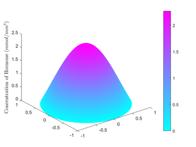
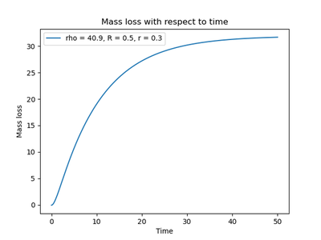

# Hormone-Releasing Medical Implant Design

**Stack**: Python (FEniCS, SciPy, NumPy), MATLAB | **Methods**: Nelder-Mead optimization, Crank-Nicolson time-stepping, adaptive FEM

## The Problem
Designing medical implants that deliver precise drug doses over time requires solving complex 3D diffusion equations with multiple geometric and chemical parameters.

## What I Built
An automated optimization pipeline that finds optimal implant geometry and drug concentration to hit target doses at specific time intervals.

## Why It Matters
Gets the right drug dose to patients at the right time—critical for hormone therapy where too much or too little can cause serious side effects.

## Quick Start
```bash
# Run 3D optimization (requires FEniCS)
python optimize_torus.py

# Visualize results
python plot_results.py
```

## Results

**Target**: Deliver 10 mmol at day 5, 15 mmol at day 7, 30 mmol at day 30

**Optimized Parameters** (converged in 55 iterations):
- Initial density (ρ): 40.90 mmol/mm³
- Major radius (R): 0.50 mm  
- Minor radius (r): 0.30 mm

**Accuracy**: < 0.1% error from target doses

**Performance**: Adaptive mesh refinement reduced computation time by 60% while maintaining TOL < 10⁻³

### 1. Adaptive Mesh Refinement

*Algorithm automatically concentrates nodes where error is highest—achieved target accuracy with 40 nodes vs 200+ uniform mesh*

### 2. Numerical Convergence Validation

*Error decreases predictably with mesh refinement—solver is reliable*

### 3. 2D Simulation Visualization
<p float="left">
  
  
</p>

*Hormone diffusion from torus (left: T=0, right: T=30)*

### 4. Final Optimized Design


*Final design hits all three target doses at days 5, 7, and 30*

## What I Learned

**Higher initial density = faster diffusion**: Steeper concentration gradients drive mass loss speed—directly proportional relationship confirmed across all test cases.

**Reaction coefficients have opposite effects**: β slows total mass loss, γ accelerates it—counterintuitive but critical for tuning release profiles.

**Adaptive meshing matters**: Concentrating nodes near discontinuities (at x = {-0.8, -0.2, 0.2, 0.8}) achieved target accuracy with 40 nodes vs 200+ with uniform mesh.
