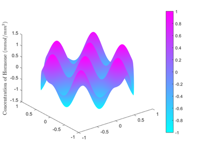

# Shape Optimization of Medical Implants via Finite Element Method

Computational design of a hormone-releasing torus implant. This project implements a full PDE-constrained optimization pipeline, from Mathematical Modeling (Fisher's Equation) to 3D Finite Element Simulation and Inverse Design.

## 🚀 Key Highlights

*   **PDE-Constrained Optimization**: Solved the inverse problem to find optimal geometric parameters ($R, r, \rho$) satisfying specific clinical drug-release targets ($M=\{10, 15, 30\}$ mmol).
*   **Adaptive Mesh Refinement (AMR)**: Derived and implemented an *a posteriori* error estimator $\eta_i$ to automatically refine meshes around singularities, optimizing computational cost.
*   **Geometric Embedding**: Modeled complex torus geometry via Level-Set Initial Conditions on a bounding domain, avoiding expensive body-fitted mesh generation.

## 📊 Technical Visuals

### 1. Adaptive Mesh Refinement (1D)
Nodes automatically concentrate around the discontinuities in the source function, validating the error estimator.

### 2. 3D Diffusion Simulation
Simulation of hormone concentration field $u(\mathbf{x}, t)$ evolving over 30 days.

### 3. Parameter Sensitivity & Mass Loss
Tracking cumulative mass loss to match clinical targets.

## 🛠️ Methodology

1.  **Governing Equation**: Fisher's Reaction-Diffusion Equation.
    $$ \frac{\partial u}{\partial t} - \alpha \Delta u = \beta u (1 - \gamma u) $$
2.  **Solver**: Crank-Nicolson (Time) + Galerkin FEM (Space).
3.  **Optimization**: Nelder-Mead Simplex Algorithm (Derivative-free).
